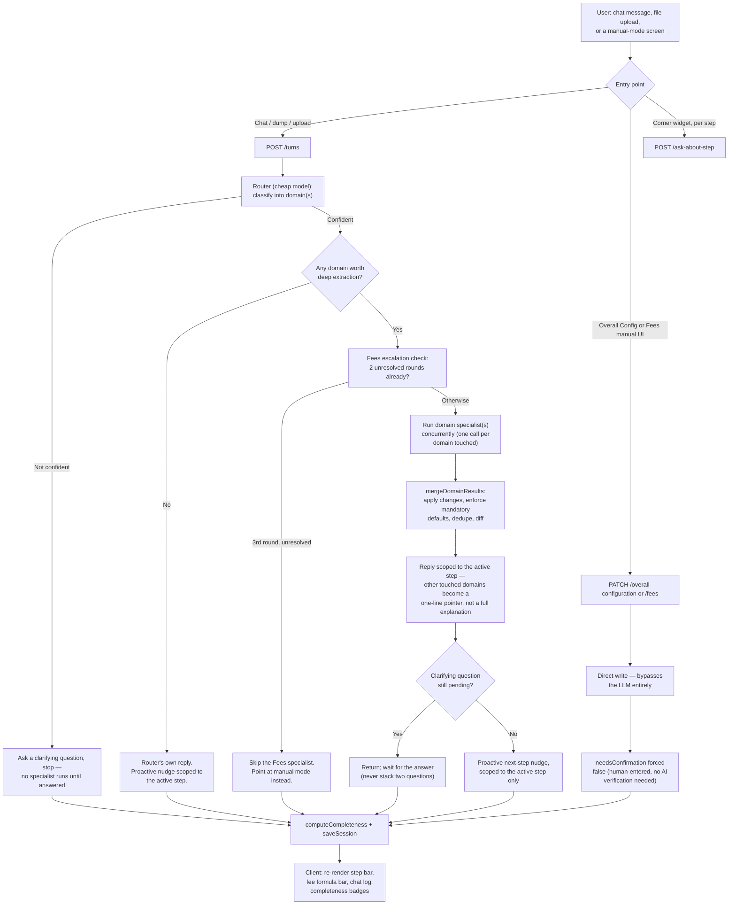

# AI-Assisted DIGIT Application Configurator

A prototype exploring how an AI chat assistant can help configure a DIGIT
license/permit application — Overall Configuration, Application Form, Fees,
Workflow, Roles, Notifications, Checklist, and Other Information — instead of
filling out every screen by hand from a blank state.

**Status: prototype for a proposal, not a production build.** There is no
separate frontend app yet — `server/public/harness.html` is a single-file
working surface used to demo and validate the backend's real behavior. It's
functional, not a design system.

## Why it's built the way it is

Two stakeholder positions drove the actual architecture, not just one:

- **An architect's concern**: some governments won't send configuration data
  through an external AI provider at all, and there's no fallback if the AI
  is wrong or unavailable. Some domains are simply too policy-sensitive
  (who's authorized to approve what) to leave to a model.
- **A product concern**: a single chat that fills everything is genuinely
  valuable — a user can type what they know in whatever order, without
  first figuring out which screen it belongs to.

The resolution: **every step has its own real, deterministic screen**
(so nothing is AI-dependent to function at all), and **chat is a
scoped assistant layered on top of that screen**, not a replacement for it.
How much of each step is screen vs. chat differs by how well that step's
data fits natural language:

| Step | Primary surface | Why |
|---|---|---|
| Overall Configuration | Full-screen guided wizard, direct-write | Deterministic questions (validity mode, category levels) — no real AI leverage, matches the architect's own read |
| Application Form | 75% live-rendered form / 25% chat | Fields are described well in prose, but seeing the form as it grows matters |
| **Fees** | 100% chat, with a live formula bar and a manual mode always one click away | The one domain everyone agreed AI earns its cost on (slab/matrix logic is genuinely hard to hand-configure) — and therefore the one domain with the most governance: see below |
| Workflow / Roles / Notifications / Checklist / Other Information | 75% live-rendered panel / 25% chat | Graph-shaped or list-shaped data, still described well enough in prose to save typing |

### Fees' extra governance

Fees is where a wrong AI judgment is a real financial mistake (over- or
under-charging every applicant), not a cosmetic one, so it gets rules the
other domains don't:

- **Chain-of-thought gate**: before extracting anything, the model must
  explicitly decide flat vs. percentage vs. matrix-dependent — the single
  highest-cost mistake this domain can make — rather than defaulting to
  whichever is easiest to fill in.
- **Draft → confirm, not auto-final**: any new or changed fee logic sets
  `needsConfirmation: true` and the reply must walk through a worked example
  and explicitly ask the user to confirm it. Nothing is treated as settled
  until a human says so.
- **2-clarify escalation**: two unresolved clarifying rounds on a fee, and
  the third round doesn't retry chat — it points the user at manual mode.
- **Manual mode, always available**: a real, deterministic "Add Fee
  Component" wizard (mode choice → components → dependent field → ranges →
  matrix → add-ons) that writes directly to the definition, bypassing the
  AI entirely — a human building it on the screen needs no verification
  step.
- **Review & Continue**: before leaving the step, a plain-language summary
  of what the configuration actually means for an applicant, plus a real
  computed total for every distinct case (not just the structure restated).

### Everywhere else

- **Attribution**: extracted Application Form fields carry a `source` —
  either the real uploaded filename or "Described in chat" — surfaced via a
  "Where did this come from?" toggle, not shown inline by default.
- **Scoped replies**: one message or document can legitimately touch more
  than one domain at once (a fee amount printed right on an application
  form). The domain you're actively viewing gets the full explanation;
  anything else gets a one-line pointer ("This also updated Fees — see that
  screen") — full data still lands, it's just not narrated on a screen it
  doesn't belong on.
- **First-visit orientation**: the first time you click into any step (even
  one a template already pre-filled), you get a full-screen welcome with
  real starter prompts grounded in *this* session's actual data — generated
  fresh, and shown as genuinely empty (no chips) when there's nothing yet
  to ground a suggestion in.

## Running it locally

Requires Node 20+ (built and tested on Node 24) and an OpenAI API key.

```bash
cd server
npm install
cp .env.example .env
# then edit .env:
#   OPENAI_API_KEY=sk-...
#   API_SHARED_SECRET=<any string you choose>
npm run dev
```

Open `http://localhost:8787/harness.html`. The first request prompts for the
`API_SHARED_SECRET` you set in `.env` — every `/api/sessions*` route requires
it as a `Bearer` token.

Other scripts:
- `npm run typecheck` — `tsc --noEmit`
- `npm run smoke` — a quick end-to-end smoke script (`scripts/smoke.ts`)

## How a turn actually flows



## Project layout

```
server/
  src/
    llm/                Router, per-domain specialists, next-step nudges,
                         doc-grounded Q&A, welcome-starter generation —
                         all the actual OpenAI calls live here
    domain/              Pure functions: merge results into the definition,
                         enforce mandatory defaults, diff, resolve
                         cross-references
    schemas/             Zod schemas (LLM-facing) + the canonical
                         ApplicationDefinition <-> LLM-shape converters
    types/               The canonical ApplicationDefinition type
    routes/              Express routes (sessions, turns)
    store/                SQLite-backed session persistence
    templates/            Seed template library + template-match logic
    knowledge/            Per-step reference docs for the "ask about this
                         step" corner widget (one markdown file per domain)
  public/
    harness.html         The actual working UI — one file, no build step
```

## Known gaps, stated plainly

- No separate frontend app — `harness.html` is the real, working surface,
  not a placeholder for one.
- Fees' manual "Custom Logic" path supports one dependent field at a time;
  chat already handles multi-field combinations, the manual UI doesn't yet.
- Attribution (`source`) is wired up for Application Form fields only, not
  yet extended to Fees, Workflow, Roles, Notifications, or Checklist.
- This configurator's job ends at producing a confirmed definition — it
  does not implement the downstream services a real deployment would need
  (fee-config compilation, a runtime evaluator service, billing
  integration). Those are real, separate DIGIT platform components.
